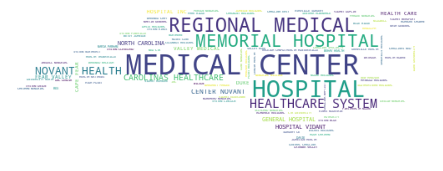
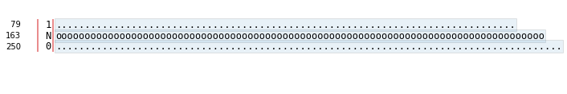
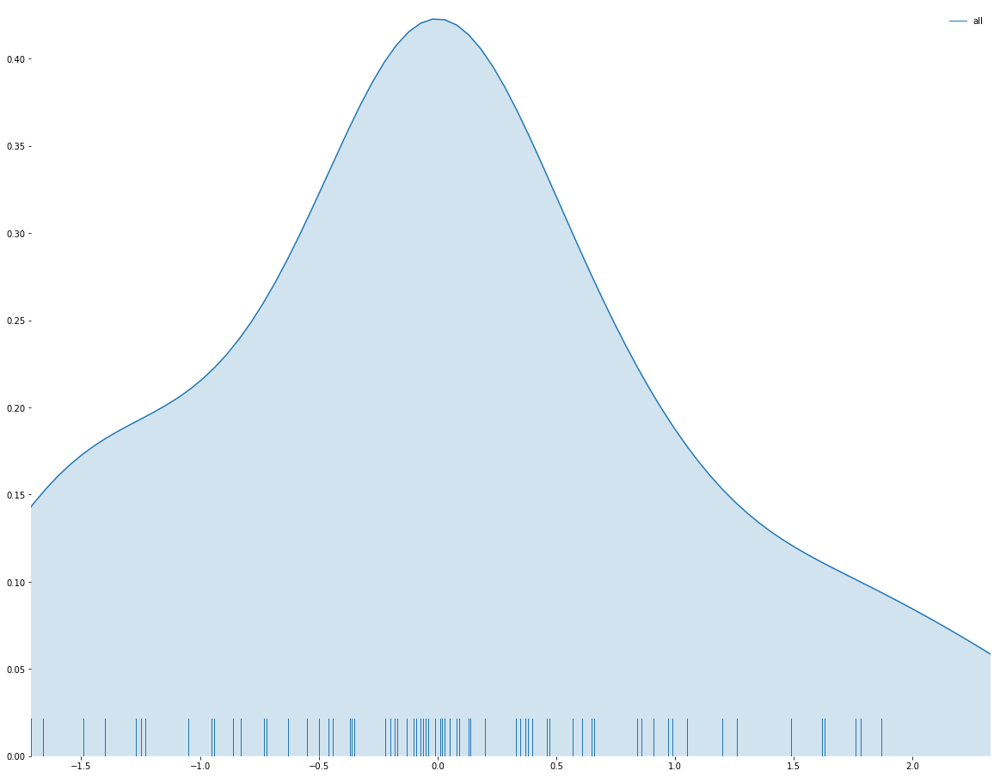
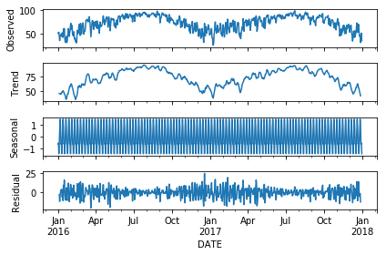
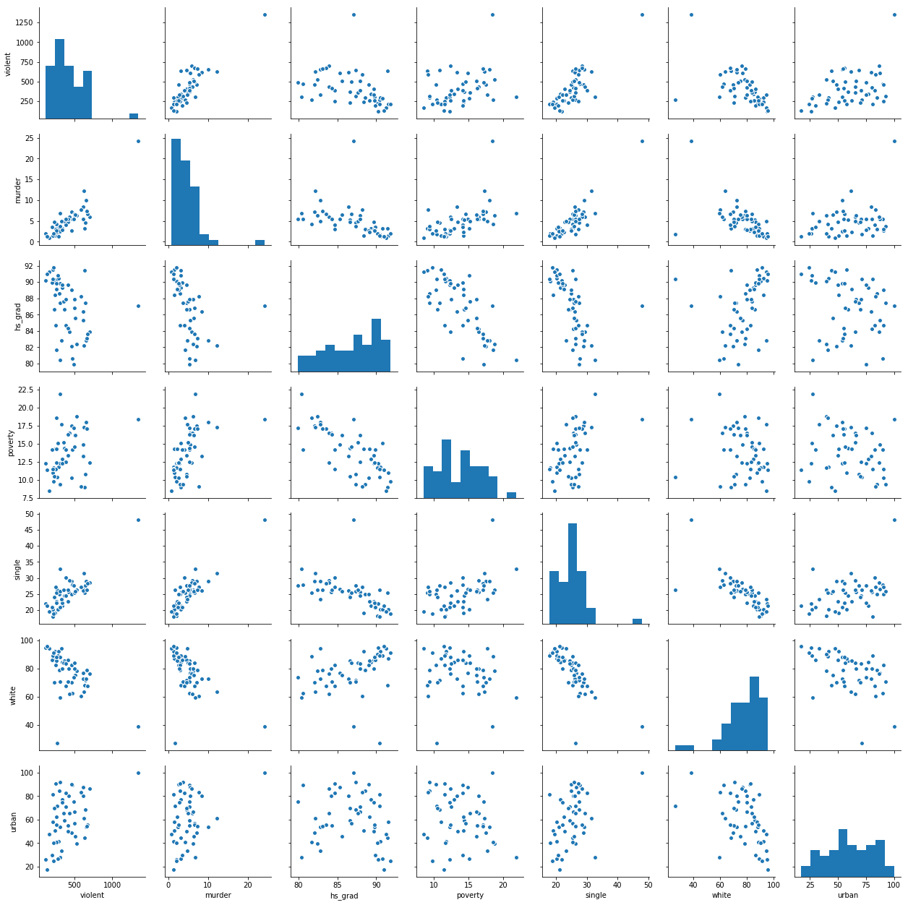
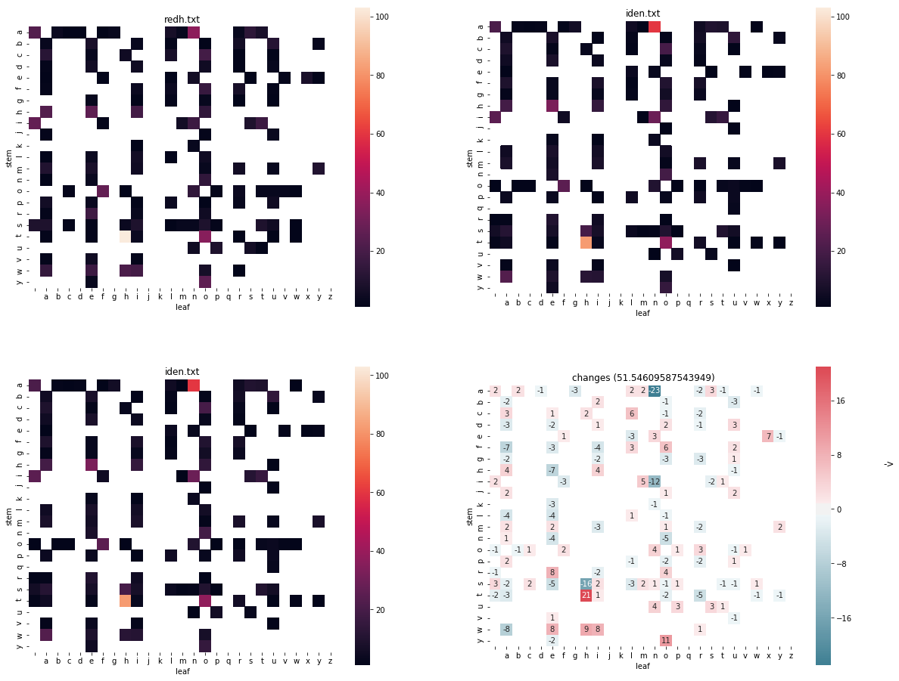

# RENCI_talk
Exploratory Visualization of Data and Text

Presented on April 26 2018 at RENCI in Chapel Hill for TriPython

> A graphic is never an end in itself; it is a moment
> in the process of decision making.
>
> -- <cite>Jacques Bertin</cite>

### About me
Francois Dion

Chief Data Scientist

Dion Research LLC

fdion @ dionresearch.com

[@f_dion](http://twitter.com/f_dion)

### Overview

A presentation in 5 notebooks, tackling missing data (completeness),
invalid data (validity), ranking, mixed data types, knowing when to trust
a visualization and knowing when
to drill down further, doing comparisons, finding relationships, looking
at hidden traps like imputations, looking at distributions, comparing words
and distance metrics for exploratory visualization, and finally comparing
whole texts. If you've not attended the talk, some insight will be missing,
but at least the notebooks provide many suggestions of tools and approaches.

### Notebook 1
Notebook 1 shows typical average quality data sources and how 
missing data in itself is not an absolute metric, if the data is representing
missing data in a non standard way... Else you could get a false sense
of security about your data. Visualizations covered: missing data matrix (missingno),
stem-and-leaf plot for mixed data types (stem_graphic.alpha), word clouds vs word
frequency plots and word sunbursts.

### Notebook 2
Notebook 2 brings up the issue of wrong data types, often discovered by
trying to visualize the data (such as a seaborn boxplot). It also tackles the question
of distribution, of comparisons and of combining multiple views of the data into one
visualization to gain better understanding of it.

### Notebook 3
Notebook 3 tackles a specific data type: time series and how interactive
visualizations can help drill down and compare this type of data, and how
it is easy to create derived representations using these visualizations (like spread).
Going back to data types, indexes are extremely important for time series. They
should also have a proper frequency set, which potentially introduces more missing values
(we are back at square one, or I should say Notebook 1). We also answer the question
of composition. Time series composition can be infered to a certain degree. For other
type of data, ternary plots, stacked bar charts or area charts etc, are more
appropriate, but data probably needs to be massaged to add to 100%.

### Notebook 4
Notebook 4 sees more data issues, such as byte chars instead of strings. We also
compare the composition of population using percentages and line and bar charts,
again using a plot with hover information, zoom and feature selection. We also
investigate the relationships between these features using pair plots and correlation
heatmaps.

### Notebook 5
Notebook 5 addresses the question of how to do visual comparisons of words, and how
to compare multiple documents

### Modules

Basic building blocks

 - [numpy](http://numpy.org)
 - [pandas](http://pandas.pydata.org/pandas-docs/stable/)
 - [Matplotlib](http://matplotlib.org/)
 
Statistical (for decomposition)

 - [statsmodels](http://www.statsmodels.org/stable/index.html)

Visualization

 - [Matplotlib](http://matplotlib.org/)
 - [Seaborn](https://github.com/mwaskom/seaborn)
 - [Stemgraphic](http://stemgraphic.org)
 - [cufflinks](https://github.com/santosjorge/cufflinks)
 - [missingno](https://github.com/ResidentMario/missingno)
 - [wordcloud](https://github.com/amueller/word_cloud)
 - [kinemathic](https://github.com/dionresearch/kinemathic)
 
 And pandas does offer the .plot() method on dataframes, along with parallel
 coordinates, RadViz and a few other visualizations.
 
 ### Books
 
 The books I brought to the presentation:
 
   - J. Pebble, The Construction of Graphical Charts (1910)
   - W. Brinton, Graphic Presentation (1939)
   - R. Harris, Information Graphics: A Comprehensive Illustrated Reference (1999)
   - T. Munzner, Visualization Analysis and Design (2014), AK Peters
 
 Check out my ex-libris list on [LinkedIn](https://www.linkedin.com/pulse/ex-libris-data-scientist-part-v-visualization-francois-dion/)
 
 ### Extro
 There are many more fundamental questions that can be answered by visualizations
 (things like risk, outliers, trends and many many more), and several area of
 visualizations that were not even mentioned (maps and graphs just to name two)
 due to the limited amount of time for the presentation. That doesn't mean they
 shouldn't be part of your daily visual explorations of data.
  